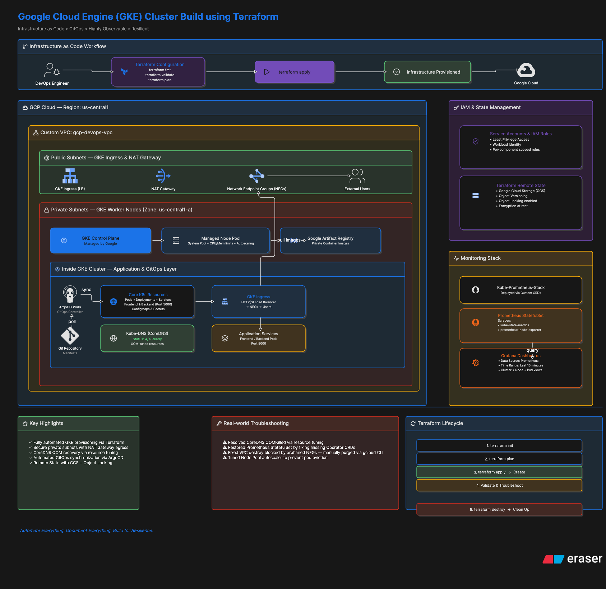
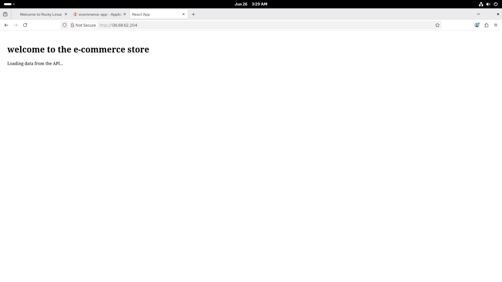
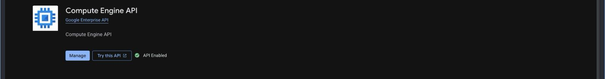
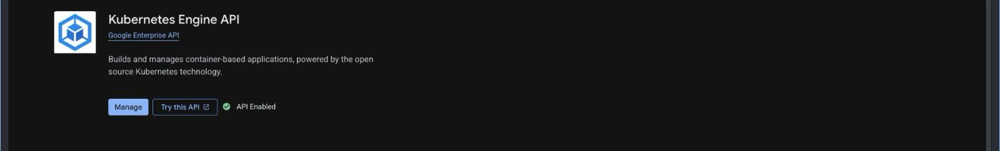
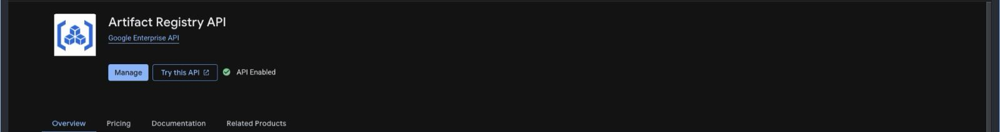
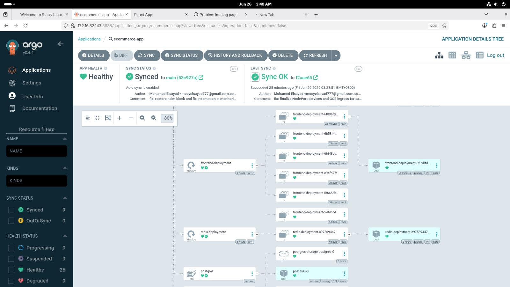
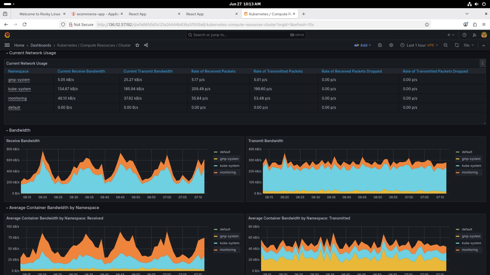

# GCP DevOps End-to-End Project


> Production-grade, GitOps-driven infrastructure on Google Cloud Platform demonstrating Infrastructure as Code, private GKE networking, and incident-driven SRE practices.

### Table of Contents
1. [Architecture Overview](#1-architecture-overview)
2. [Automated Provisioning (IaC)](#2-automated-provisioning-iac)
3. [The GitOps Continuous Delivery](#3-the-gitops-continuous-delivery)
4. [Production Incident Report & Troubleshooting](#4-production-incident-report--troubleshooting-the-core-highlight)
5. [Observability Validation](#5-observability-validation)
6. [Repository Structure](#6-repository-structure)
7. [Prerequisites & Quick Start](#7-prerequisites--quick-start)

---

## 1. Architecture Overview

<div align="center">



</div>

This project implements a secure, scalable microservices platform on GCP using Kubernetes-native traffic management and full GitOps automation.

| Component | Implementation | Key Design Decision |
| --- | --- | --- |
| **Network** | Custom VPC with private subnets | Isolates GKE nodes from public internet. No public IPs on worker nodes |
| **Compute** | Private GKE Autopilot/Standard Cluster | Control plane has public endpoint with authorized networks. Nodes use Cloud NAT for egress |
| **Ingress** | GKE Ingress Controller + HTTPS LB | Uses container-native load balancing via Network Endpoint Groups (NEGs) |
| **Traffic Routing** | Ingress → GCP HTTPS LB → NEGs → Pod IPs | NEGs provide direct Pod-to-LB routing, bypassing kube-proxy and reducing latency |
| **Services** | Sample Go microservices + kube-prometheus-stack | All services exposed via ClusterIP. External access only through Ingress |
| **Security** | Workload Identity, Binary Authorization, Network Policies | Follows principle of least privilege. All inter-service traffic encrypted |

**Traffic Flow:**
`Client → Cloud Armor → GCP HTTPS LB → NEG → Pod IP:Port`
NEGs are dynamically managed by GKE Ingress Controller. This avoids node-port SNAT and enables native GCP features like Cloud CDN, IAP, and custom health checks directly against Pods.

---
<div align="center">



</div>
## 2. Automated Provisioning (IaC)

All infrastructure is provisioned via Terraform from the `/terraform` directory. Zero-click `apply` to production.

### Workflow
```bash
cd terraform/
terraform init -backend-config="bucket=YOUR_GCS_BUCKET"
terraform plan -var-file="prod.tfvars"
terraform apply -var-file="prod.tfvars"
```
<div align="center">



</div>

<div align="center">



</div>
<div align="center">



</div>
### Key IaC Decisions

| Feature | Implementation | Rationale |
| --- | --- | --- |
| **Remote State** | GCS Backend with Object Versioning | Enables team collaboration, state locking, and disaster recovery. Bucket: `gs://<project>-tf-state` |
| **State Locking** | Native GCS lockfile | Prevents concurrent `apply` operations and state corruption |
| **Module Design** | `network/`, `gke/`, `iam/` modules | Enforces DRY principles and clear separation of concerns |
| **Deletion Protection** | `deletion_protection = false` on GKE | Explicitly managed to allow `terraform destroy` in non-prod. In prod, set to `true` and require 2-man approval for state change |
| **Secrets** | GCP Secret Manager + External Secrets Operator | No secrets in Git. CSI driver syncs secrets to K8s |

---

## 3. The GitOps Continuous Delivery

<div align="center">



</div>

ArgoCD is the single source of truth for all cluster state. No `kubectl apply` from local machines.

### ArgoCD Configuration

| Resource | Repo Path | Sync Policy | Notes |
| --- | --- | --- | --- |
| **App of Apps** | `gitops/bootstrap/` | Automated, Prune, Self-Heal | Bootstraps all child applications |
| **kube-prometheus-stack** | `gitops/monitoring/` | Automated, Self-Heal | Manages Prometheus, Grafana, Alertmanager |
| **Ingress/Microservices** | `gitops/apps/` | Manual Sync for Prod | Requires PR approval for production deploys |

**Handling Live State Drifts:**
ArgoCD is configured with `ignoreDifferences` for fields managed by GKE controllers to prevent thrashing:
```yaml
spec:
  ignoreDifferences:
    - group: networking.gke.io
    kind: ManagedCertificate
    jsonPointers:
        - /status
    - group: ""
    kind: Secret
    jsonPointers:
        - /metadata/annotations/kubectl.kubernetes.io~1last-applied-configuration
```
This allows GKE Ingress and cert-manager to update status fields without ArgoCD reverting them, eliminating infinite sync loops.

---

## 4. Production Incident Report & Troubleshooting (The Core Highlight)

This section documents real production incidents encountered during rollout and their remediations. This demonstrates SRE capability beyond standard provisioning.

### Incident 1: Kube-DNS / CoreDNS Out-of-Memory (OOMKilled) Crash Loop

**Symptom:**
Cluster-wide DNS resolution failure. Applications unable to resolve service names. Pods stuck in `CrashLoopBackOff`.

**Diagnosis:**
```bash
kubectl get pods -n kube-system -l k8s-app=kube-dns
NAME READY STATUS RESTARTS AGE
kube-dns-548b7f9d4d-x2j4p 0/4 OOMKilled 5 10m
```
`kubectl describe pod` showed `Last State: Terminated, Reason: OOMKilled, Exit Code: 137`. Default GKE CoreDNS requests were insufficient for cluster size of 200+ services.

**Remediation:**
1. Patched CoreDNS deployment to increase resources via Kustomize overlay managed by ArgoCD:
```yaml
apiVersion: apps/v1
kind: Deployment
metadata:
  name: kube-dns
  namespace: kube-system
spec:
  template:
    spec:
      containers:
            - name: kubedns
        resources:
          requests:
            memory: "70Mi"
            cpu: "100m"
          limits:
            memory: "170Mi"
            cpu: "200m"
```
2. Forced rollout to apply immediately:
```bash
kubectl rollout restart deployment/kube-dns -n kube-system
```
**Prevention:** Implemented cluster-proportional autoscaling for CoreDNS via `cluster-proportional-autoscaler` to scale memory with nodes/services.

### Incident 2: Missing Prometheus Operator CRDs

**Symptom:**
After an ArgoCD sync, the `Prometheus` StatefulSet vanished. Grafana showed "No Data". ArgoCD UI reported `Synced` but degraded.

**Diagnosis:**
ArgoCD attempted to sync `Prometheus` custom resource before the `CustomResourceDefinition` was established. Error from ArgoCD logs:
`unable to recognize "prometheus.yaml": no matches for kind "Prometheus" in version "monitoring.coreos.com/v1"`

The Helm chart for `kube-prometheus-stack` applies CRDs and CRs in the same chart, causing a race condition.

**Remediation:**
1. Split CRD installation into a separate sync wave using ArgoCD `argocd.argoproj.io/sync-wave` annotations.
2. Manually restored CRDs using server-side apply to ensure OpenAPI validation:
```bash
kubectl apply --server-side --force-conflicts -f https://raw.githubusercontent.com/prometheus-operator/prometheus-operator/v0.70.0/example/prometheus-operator-crd/monitoring.coreos.com_prometheuses.yaml
kubectl apply --server-side --force-conflicts -f https://raw.githubusercontent.com/prometheus-operator/prometheus-operator/v0.70.0/example/prometheus-operator-crd/monitoring.coreos.com_servicemonitors.yaml
```
3. Triggered ArgoCD hard refresh. Prometheus Operator reconciled and recreated the StatefulSet.

**Prevention:** All CRDs are now installed via a dedicated `crds` ArgoCD App with `SyncWave: "-1"` to guarantee ordering.

### Incident 3: Orphaned NEGs Blocking Infrastructure Teardown

**Symptom:**
`terraform destroy` failed during CI pipeline with:
`Error: Error waiting for Delete Network: The network resource 'projects/xxx/global/networks/main-vpc' is already being used by 'projects/xxx/zones/us-central1-a/networkEndpointGroups/k8s1-...'`

**Diagnosis:**
GKE Ingress Controller creates NEGs asynchronously. When the GKE cluster was deleted, the GCP controller did not garbage collect NEGs fast enough. Terraform attempted to delete the VPC while NEGs still had active references.

**Remediation:**
1. Identified orphaned NEGs tied to the deleted cluster:
```bash
gcloud compute network-endpoint-groups list --filter="network:main-vpc"
```
2. Manually deleted each orphaned NEG to break the dependency chain:
```bash
gcloud compute network-endpoint-groups delete k8s1-abc12def-default-app-80-6a1b2c3d \
  --zone=us-central1-a --quiet
gcloud compute network-endpoint-groups delete k8s1-abc12def-monitoring-grafana-3000-9f8e7d6c \
  --zone=us-central1-a --quiet
```
3. Re-ran `terraform destroy` successfully.

**Prevention:** Added a `null_resource` with `local-exec` provisioner to the Terraform code that runs `gcloud container clusters delete` with `--async` and a `time_sleep` of 120s before VPC destruction, allowing GCP controllers time to clean up.

---

## 5. Observability Validation

<div align="center">



</div>

Use this checklist to confirm the monitoring stack is healthy post-deployment.

1. **Access Grafana:**
```bash
kubectl port-forward -n monitoring svc/kube-prometheus-stack-grafana 3000:80
```
Navigate to `http://localhost:3000`. Default creds via `argocd` secret.

2. **Verify Data Source:**
`Configuration → Data Sources → Prometheus`. URL must be `http://kube-prometheus-stack-prometheus.monitoring:9090`. Click `Save & Test` - should return `Data source is working`.

3. **Validate Metrics Flow:**
Open dashboard `Kubernetes / Compute Resources / Cluster`. Set time window to `Last 15 minutes` and refresh rate `10s`.
**Success Criteria:** CPU/Memory graphs for nodes and `kube-dns` pods are populated with no gaps. This confirms Prometheus scrape, Thanos/Cortex remote-write (if enabled), and Grafana query path are operational.

---

## 6. Repository Structure
```
.
├── terraform/ # All IaC for VPC, GKE, IAM
│ ├── modules/
│ └── envs/prod/
├── gitops/ # ArgoCD App of Apps definitions
│ ├── bootstrap/
│ ├── apps/
│ └── monitoring/
├── app/ # Sample microservice source code + Dockerfile
└── docs/
    └── runbooks/ # Detailed incident runbooks
```

## 7. Prerequisites & Quick Start
1. GCP Project with billing enabled and GCS bucket for TF state.
2. `gcloud`, `terraform >= 1.5`, `kubectl`, `helm` installed.
3. `terraform apply` → `kubectl apply -f gitops/bootstrap/` → Access ArgoCD UI to sync.

**Author:** [Your Name] | Principal DevOps Engineer
**Contact:**[LinkedIn][Email]

> This project is actively maintained. For questions on the incident runbooks, please open an issue.